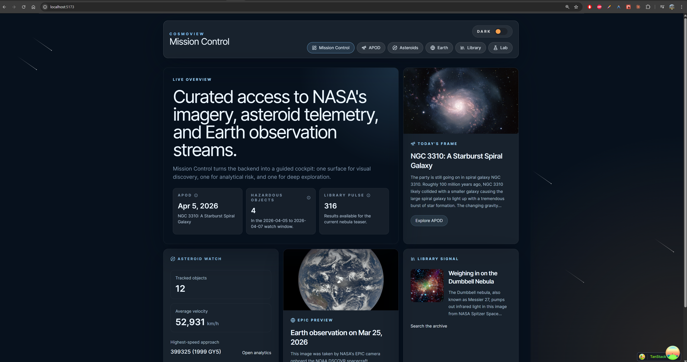
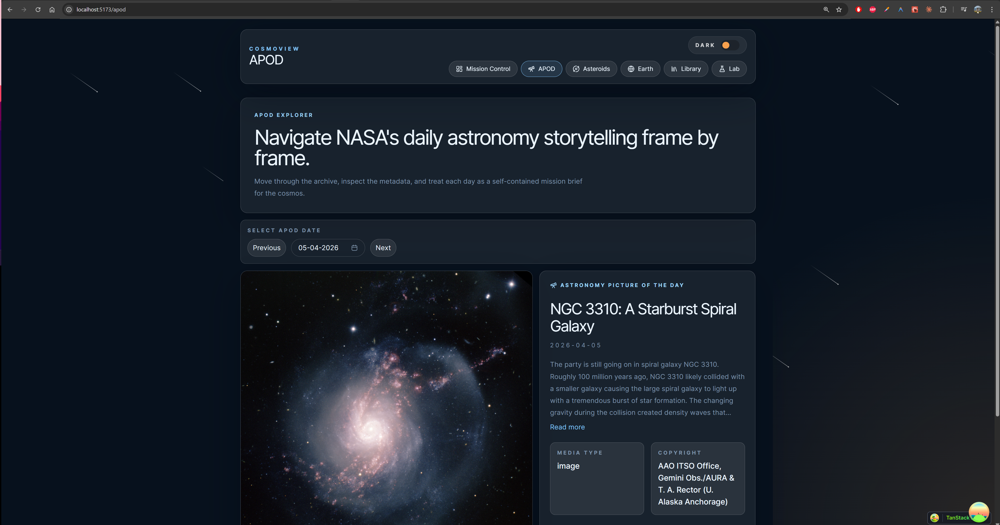
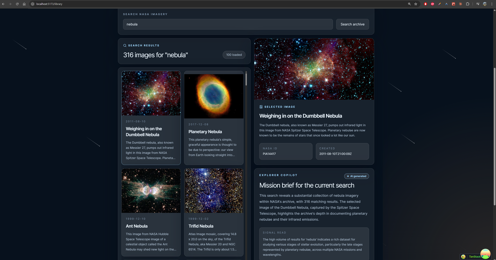

# CosmoView

CosmoView is a full-stack NASA exploration platform built with React, Vite, TypeScript, and Express. It turns several NASA public data sources into a mission-control style product with curated discovery flows for Astronomy Picture of the Day, near-Earth objects, EPIC Earth imagery, archive search, and an engineering lab for reviewers.

[Live Frontend](https://cosmo-view.vercel.app) | [Live Backend API](https://cosmoview.onrender.com)


## Live Demo

| Surface | URL |
| --- | --- |
| Frontend | https://cosmo-view.vercel.app |
| Backend API | https://cosmoview.onrender.com |

## Screenshots







## Feature Tour

### Mission Control

The homepage acts as a cross-feature dashboard instead of a landing page filler screen. It previews APOD, asteroid activity, EPIC imagery, and NASA archive search so users can jump directly into the area they want without losing context.

### Astronomy Picture of the Day

The APOD route supports archive browsing back to June 16, 1995 with date navigation, typed backend validation, and dedicated loading and error states. The frontend renders the normalized APOD payload rather than dealing with raw NASA field names or media-shape quirks.

### Asteroid Analytics

The asteroid experience combines NASA NeoWs data with UI built for scanning. Users can choose a valid date range, review a normalized analytics summary, sort the results table by multiple columns, and paginate through large result sets without rethinking the dataset. The seven-day NASA limit is enforced on both the frontend and backend.

### Earth / EPIC Explorer

The Earth route presents EPIC natural imagery as an exploration surface rather than a static gallery. Users can inspect available frames for a day, switch between captures, and review metadata such as coordinates and capture timing from a frontend contract that is already normalized by the backend.

### NASA Image Library

The Library route provides archive search against NASA's image catalog with infinite pagination, result selection, and a stable detail panel. Search results are normalized server-side so the UI can work with consistent preview, description, and pagination fields even though the upstream NASA payload is irregular.

### Explorer Copilot

The Library route includes an Explorer Copilot panel. It starts with an instant heuristic mission brief generated locally from the active query, total result count, and selected item. If AI is configured on the backend, the user can request a richer mission brief through `POST /api/v1/ai/mission-brief`; if AI is unavailable, expired, or rate-limited, the experience falls back cleanly instead of breaking the route.

### Build Lab

`/lab` is a reviewer-facing route that documents the stack, architecture, loading system, backend contract, endpoint catalog, and sample responses. It is driven by the backend discovery endpoint so the documentation shown in the product reflects the actual API surface.

### UX and polish

CosmoView also includes a persisted light/dark theme, responsive layouts across phone-to-desktop breakpoints, keyboard-friendly navigation, screen-reader-aware loading states, and route-level error boundaries with explicit retry paths.

## Architecture

CosmoView is intentionally split into two applications:

- `frontend/`: React 19 + Vite + TypeScript UI, organized by feature under `src/features`
- `backend/`: Express + TypeScript API layer that owns NASA integrations, validation, caching, and response normalization

Data flow:

1. The frontend calls only the Express backend.
2. Express validates request input with Zod.
3. NASA services fetch from APOD, NeoWs, EPIC, Image Library, and optional Gemini AI sources.
4. Upstream payloads are validated and mapped into stable DTOs.
5. The backend returns consistent `{ data, meta }` envelopes and structured error responses.
6. React Query caches the result and Suspense boundaries reveal the UI when data is ready.

This keeps API keys on the server, isolates NASA-specific response quirks, and gives the frontend a stable typed contract.

## Performance and UX

### Caching

The backend uses a lightweight in-memory TTL cache to reduce repeated NASA calls and improve demo responsiveness.

- APOD responses are cached for 1 hour.
- EPIC responses are cached for 30 minutes.
- Asteroid feed responses are cached for 15 minutes.
- Image Library search responses are cached for 15 minutes.
- AI mission briefs are cached for 2 hours when the AI integration is enabled.

The frontend also uses TanStack Query with a default `staleTime` of 5 minutes and `gcTime` of 10 minutes. That keeps revisits fast while still allowing background freshness rules to remain predictable.

### Loading strategy

- Route data is rendered through React Suspense boundaries.
- TanStack Router uses `defaultPreload: 'intent'` so route data can begin warming when users signal navigation intent.
- Content-shaped skeleton states are used for APOD, Earth, Library, and other data-heavy surfaces instead of generic spinners.
- Mission and archive images use native `loading="lazy"` and `decoding="async"` where appropriate to reduce initial work on the main thread.

### Resilience

- The backend applies a global API rate limiter and separate burst/hourly/daily limits for AI requests.
- Structured error envelopes keep failures consistent for the frontend.
- Route-level error boundaries expose visible retry actions instead of dead-end failure states.
- Request validation happens before upstream calls, including the NeoWs seven-day range constraint.

## API Surface

Current backend endpoints:

- `GET /health`
- `GET /dev/endpoints`
- `GET /api/v1/apod`
- `GET /api/v1/asteroids/feed`
- `GET /api/v1/epic/natural`
- `GET /api/v1/images/search`
- `POST /api/v1/ai/mission-brief`

All successful data routes return a consistent envelope:

```json
{
  "data": {},
  "meta": {
    "requestId": "uuid",
    "cached": false
  }
}
```

Errors return a structured shape:

```json
{
  "error": {
    "code": "VALIDATION_ERROR",
    "message": "Validation failed."
  }
}
```

## Local Development

### Repository structure

```text
frontend/   React application
backend/    Express API
docs/       notes and planning documents
README.md   root project documentation
```

### Prerequisites

- Node.js 20+
- npm 10+
- A NASA API key from https://api.nasa.gov/

### Backend setup

Create `backend/.env` from `backend/.env.example`.

Minimum values:

```env
PORT=3001
NODE_ENV=development
NASA_API_KEY=your_nasa_api_key
FRONTEND_ORIGIN=http://localhost:5173
NASA_API_TIMEOUT_MS=10000
NASA_CACHE_TTL_APOD_MS=3600000
NASA_CACHE_TTL_ASTEROIDS_MS=900000
NASA_CACHE_TTL_IMAGES_MS=900000
NASA_CACHE_TTL_EPIC_MS=1800000
RATE_LIMIT_WINDOW_MS=60000
RATE_LIMIT_MAX_REQUESTS=60
```

Optional AI values:

```env
GOOGLE_AI_API_KEY=your_google_ai_key
AI_ENABLED_UNTIL=2026-12-31T23:59:59.000Z
AI_RATE_LIMIT_BURST_MAX=2
AI_RATE_LIMIT_HOURLY_MAX=8
AI_RATE_LIMIT_DAILY_MAX=25
```

### Frontend setup

Create `frontend/.env` from `frontend/.env.example`.

```env
VITE_API_BASE_URL=http://localhost:3001
```

### Install dependencies

```bash
cd backend
npm install
```

```bash
cd frontend
npm install
```

### Run locally

```bash
cd backend
npm run dev
```

```bash
cd frontend
npm run dev
```

Local URLs:

- Frontend: `http://localhost:5173`
- Backend: `http://localhost:3001`

## Testing

Backend checks:

```bash
cd backend
npm run test
npm run check
npm run build
```

Frontend checks:

```bash
cd frontend
npm run check
npm run build
npm run test:e2e
```

The repository includes Playwright coverage for navigation, loading states, error states, APOD flows, asteroid flows, Earth flows, and library flows. Backend tests cover the Express app and service behavior with Vitest and Supertest.

## CI/CD

GitHub Actions handles both pull request validation and production deployment from `.github/workflows/ci.yml` and `.github/workflows/deploy.yml`.

### CI on pull requests

For pull requests targeting `master`, the `CI` workflow runs:

- Backend job on Ubuntu with Node 20
- `cd backend && npm ci`
- `cd backend && npm run check`
- `cd backend && npm test`
- Frontend job on Ubuntu with Node 20
- `cd frontend && npm ci`
- `cd frontend && npm run check`

This means every PR is gated by backend type safety, backend unit/integration tests, and frontend type checking before merge.

### Deployment on push to master

For pushes to `master`, the `Deploy` workflow runs in three stages:

1. `checks`
   - Installs backend and frontend dependencies on Ubuntu with Node 22
   - Runs backend type checks
   - Runs backend tests
   - Runs frontend type checks
2. `deploy`
   - Triggers the Render deploy hook for the backend
   - Deploys the frontend to Vercel in production mode
   - Polls `https://cosmoview.onrender.com/health` until the new backend deployment is healthy
3. `e2e`
   - Installs Playwright Chromium
   - Runs the frontend Playwright suite against the live production deployment at `https://cosmo-view.vercel.app`
   - Uploads the Playwright report as a GitHub Actions artifact

The deployment pipeline is intentionally ordered so that no production deployment happens until the codebase passes the required checks, and no post-deploy verification runs until both backend and frontend releases are live.

## Deployment

### Frontend on Vercel

- Root directory: `frontend`
- Build command: `npm run build`
- Output directory: `dist`
- Required environment variable: `VITE_API_BASE_URL=https://cosmoview.onrender.com`

SPA rewrites are configured in [`frontend/vercel.json`](/D:/jobhunt/bounceinsight/CosmoView/frontend/vercel.json).

### Backend on Render

- Root directory: `backend`
- Build command: `npm install && npm run build`
- Start command: `npm run start`
- Health check path: `/health`

Render service configuration is included in [`render.yaml`](/D:/jobhunt/bounceinsight/CosmoView/render.yaml).

Required backend environment variables in production:

- `NASA_API_KEY`
- `FRONTEND_ORIGIN`
- `PORT`
- `NODE_ENV`

GitHub Actions deployment also expects these repository secrets:

- `RENDER_DEPLOY_HOOK_URL`
- `VERCEL_TOKEN`
- `VERCEL_ORG_ID`
- `VERCEL_PROJECT_ID`

## Engineering Notes

- NASA-facing logic stays entirely on the backend; the frontend never talks directly to NASA services.
- The backend validates environment variables, query params, and upstream payloads with Zod.
- The API is intentionally normalized into frontend-friendly DTOs so route components do not depend on unstable upstream response shapes.
- The Lab route doubles as product documentation for reviewers and as a live sanity check for the backend contract.
- Additional implementation notes are available in [`docs/backend-implementation.md`](/D:/jobhunt/bounceinsight/CosmoView/docs/backend-implementation.md), [`docs/backend-plan.md`](/D:/jobhunt/bounceinsight/CosmoView/docs/backend-plan.md), and [`docs/frontend-plan.md`](/D:/jobhunt/bounceinsight/CosmoView/docs/frontend-plan.md).
